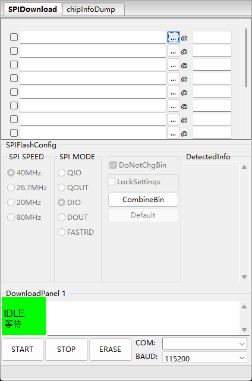
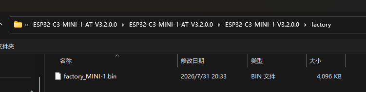
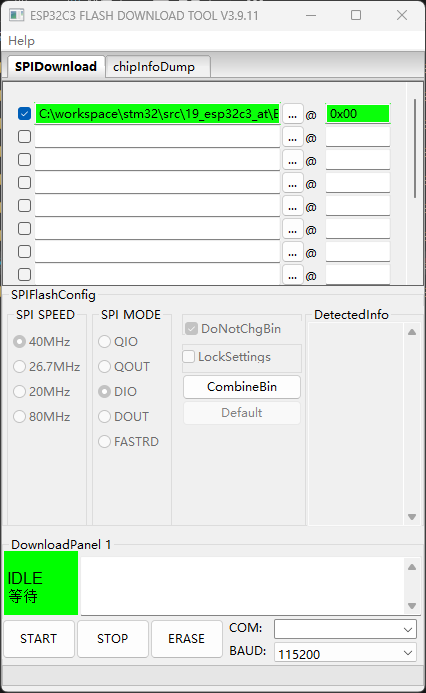
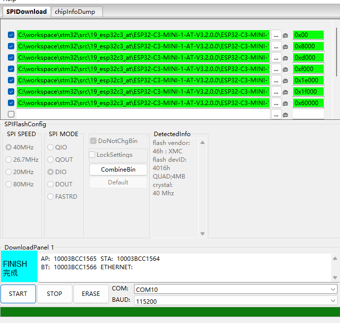

# CLion 与 ESP32 环境搭建

> 参考文献
> - [ESP-IDF 在 CLion 中的使用](https://docs.espressif.com/projects/esp-idf/zh_CN/stable/esp32/third-party-tools/clion.html#id4)
> - [Configuring an ESP-IDF Project](https://developer.espressif.com/blog/clion/#configuring-an-esp-idf-project)
> - [ESP-IDF Windows Setup Guide](https://docs.espressif.com/projects/esp-idf/en/stable/esp32s3/get-started/windows-setup.html)

## 一、安装环境

### 1.1 必备组件

- Git
- Python

### 1.2 安装 ESP-IDF

1. 前往 [ESP-IDF 安装管理器](https://dl.espressif.com/dl/eim/) 下载安装包。
2. 打开后会有安装指引，直接按指引操作即可。
3. **建议使用自定义安装**，完整安装 ESP-IDF 全家桶。

### 1.3 配置 CLion ESP-IDF 工具链

### 1.4 配置 CLion 项目启动器

### 1.5 配置 CLion 运行环境

## 二、烧录工具 flash_download_tool

1. 前往 [flash_download_tool 下载页](https://docs.espressif.com/projects/esp-test-tools/en/latest/esp32/production_stage/tools/flash_download_tool.html) 下载对应版本的烧录工具。
2. 或直接下载：[flash_download_tool.zip](https://dl.espressif.com/public/flash_download_tool.zip)。

## 三、AT 固件

### 3.1 下载

前往 [ESP-AT 下载指南](https://docs.espressif.com/projects/esp-at/zh_CN/release-v3.2.0.0/esp32c3/Get_Started/Downloading_guide.html) 下载对应版本的 AT 固件。

### 3.2 烧录

完整烧录地址映射（来自 `flasher_args.json` / `download.config`）：

| 偏移地址 | 烧录文件 |
|----------|----------|
| `0x0`    | `bootloader/bootloader.bin` |
| `0x8000` | `partition_table/partition-table.bin` |
| `0xd000` | `ota_data_initial.bin` |
| `0xf000` | `phy_multiple_init_data.bin` |
| `0x1e000` | `at_customize.bin` |
| `0x1f000` | `customized_partitions/mfg_nvs.bin` |
| `0x60000` | `esp-at.bin`（约 `factory_MINI-1.bin`） |

> 若 USB 连接后，设备不停地提示音，需要短接 `P9` 与 `GND`，进入 Boot 模式后再进行烧录。